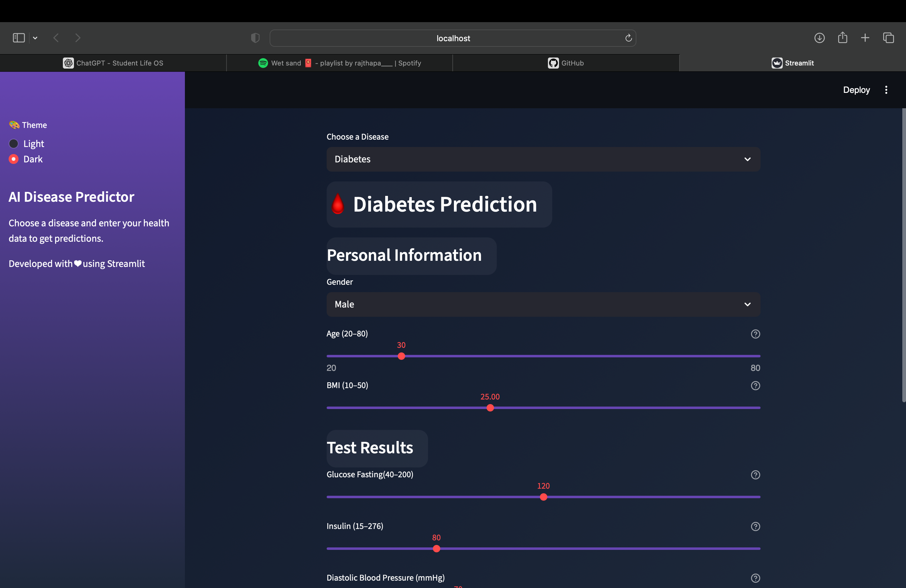
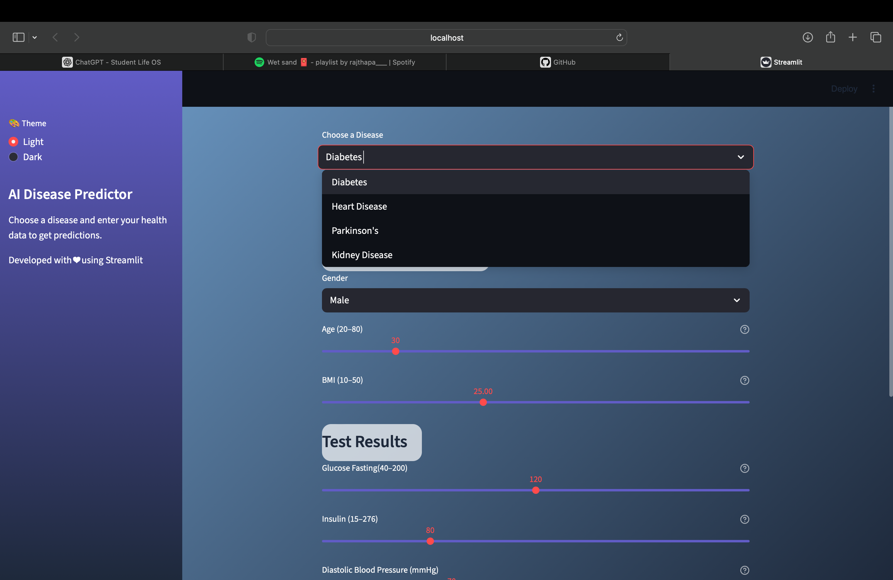
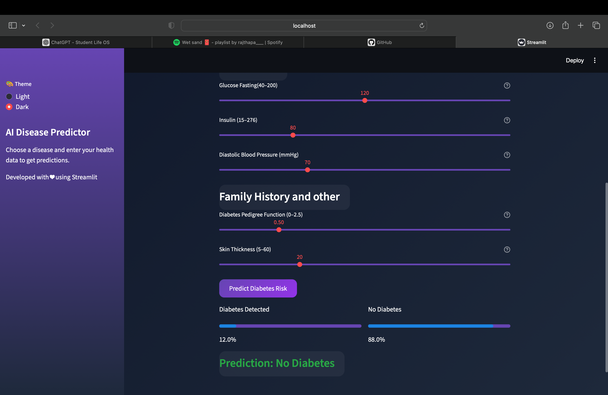

<h1 align="center"><b>AI Disease Prediction System</b></h1>

<p align="center">
An AI-powered web application that predicts the likelihood of multiple diseases such as <b>Diabetes, Heart Disease, Parkinson's and Chronic Kidney Disease</b> based on user-provided health parameters.
<br>
Built using <b>Python</b> and <b>Streamlit</b>, this system leverages machine learning models to assist in early disease detection.
</p>

<p align="center">
  
  
  
  
  
  
  
  
  
  
</p>

---

## 📌 Project Overview

This project provides an interactive web-based platform where users can input medical parameters and receive real-time disease risk predictions.

It integrates:
- Machine Learning model training
- Data preprocessing pipelines
- Model serialization
- Streamlit-based deployment

---

## 🧪 Features

- ✅ Multi-Disease Prediction (Diabetes, Heart, Parkinson's, Kidney)
- ✅ Interactive Streamlit UI
- ✅ Trained ML models with saved scalers & feature sets
- ✅ Confidence score display
- ✅ Feature importance visualization
- ✅ Modular and scalable architecture
- ✅ Easy local deployment

---

## 📸 Demo Screenshots

### Dark Mode
<p align="center">
  
</p>

### Light Mode & Feature Selection
<p align="center">
  
</p>

### 📊 Prediction Dashboard
<p align="center">
  
</p>

---

## 🚀 Future Upcoming Features

### 📸 Image-Based Disease Detection
- Upload or capture medical images (e.g., skin, eye, throat conditions)
- Deep Learning (CNN) powered analysis
- Early-stage detection assistance
- Confidence score with safety disclaimer

### 🤖 AI-Powered Medical Chatbot
- Conversational symptom checker
- Smart follow-up questioning
- Preliminary risk assessment
- Calm and safe medical guidance
- Pediatric and adult health coverage

### 🧬 Personalized Risk Assessment Engine
- Genetic history integration
- Lifestyle & dietary habit analysis
- Recent medical history evaluation
- Dynamic risk scoring (Low / Moderate / High)

### 💊 Health Guidance Module
- General treatment awareness
- Commonly prescribed medicine information (no dosage advice)
- Home remedies for mild conditions
- Preventive lifestyle recommendations

### 📊 Smart Health Reports
- Downloadable PDF health summary
- Risk breakdown with visual insights
- Recommendation checklist

### 👤 User Accounts & Dashboard
- Secure login system
- Prediction history tracking
- Health trend monitoring
- Personalized recommendations over time

### 👨‍⚕️ Doctor Recommendation Integration
- Specialist suggestions based on prediction
- Category-based doctor directory (Child, Adult, Specialist)
- Emergency warning alerts when required

### 🌍 Multi-Disease Expansion
- Diabetes prediction
- Liver disease detection
- Lung condition analysis
- Stroke risk prediction
- Thyroid disorder assessment
- Anemia detection

---

⚠️ Note: This system is designed for educational and early screening purposes only and will not replace professional medical consultation.

## 💻 Tech Stack

**Programming Language:** Python  
**Machine Learning:** Scikit-learn, XGBoost  
**Web Framework:** Streamlit  
**Data Handling:** Pandas, NumPy  
**Visualization:** Matplotlib, Seaborn  
**Model Serialization:** joblib / pickle  
**Deployment:** Streamlit Cloud  

---

## 📁 Folder Structure

```bash
AI_Disease_Predictor/
│
├── app/
│   └── streamlit_app.py            # Main Streamlit application
│
├── models/                         # Trained ML models and preprocessing files
│   ├── diabetes.pkl
│   ├── diabetes_scaler.pkl
│   ├── heart.pkl
│   ├── kidney.pkl
│   ├── parkinsons.pkl
│   └── ...
│
├── notebooks/                      # Model training notebooks
│   ├── diabetes_model.ipynb
│   ├── heart_model.ipynb
│   ├── kidney_model.ipynb
│   └── parkinsons_model.ipynb
│
├── data/                           # Dataset files
│   ├── diabetes.csv
│   ├── heart.csv
│   ├── kidney_disease.csv
│   └── parkinsons.csv
│
├── requirements.txt
└── README.md
```
## 🚀 Getting Started

### 1️⃣ Clone the Repository

```bash
git clone https://github.com/dataqubit404/AI-Based-Disease-Predictor.git
cd AI-Based-Disease-Predictor
```

### 2️⃣ Create Virtual Environment

**Windows**

```bash
python -m venv venv
venv\Scripts\activate
```

**macOS / Linux**

```bash
python3 -m venv venv
source venv/bin/activate
```

### 3️⃣ Install Dependencies

```bash
pip install -r requirements.txt
```

### 4️⃣ Run the Application

```bash
streamlit run app/streamlit_app.py
```

## 📊 Model Training

The machine learning models are trained using the datasets located in the `data/` folder. Jupyter notebooks in the `notebooks/` directory provide step-by-step guidance on training models for each disease:

- **Diabetes:** notebooks/diabetes_model.ipynb  
- **Heart Disease:** notebooks/heart_model.ipynb  
- **Chronic Kidney Disease:** notebooks/kidney_model.ipynb  
- **Parkinson's Disease:** notebooks/parkinsons_model.ipynb  

Each notebook includes:

- Data preprocessing  
- Feature selection  
- Model training  
- Model evaluation  
- Saving trained models and scalers  

After training, models are stored inside the `models/` directory for deployment.

---

## 📄 License

Only for Educational Purposes.

---

## 📬 Contact

For any inquiries, collaborations, or contributions, please contact:

👨‍💻 **GitHub:** https://github.com/dataqubit404  

You can also open an issue in the repository for questions or suggestions.


